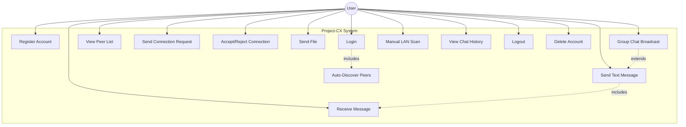
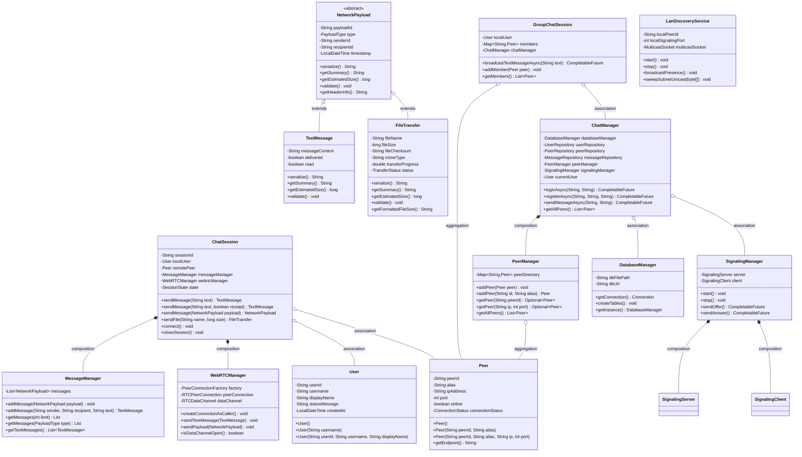
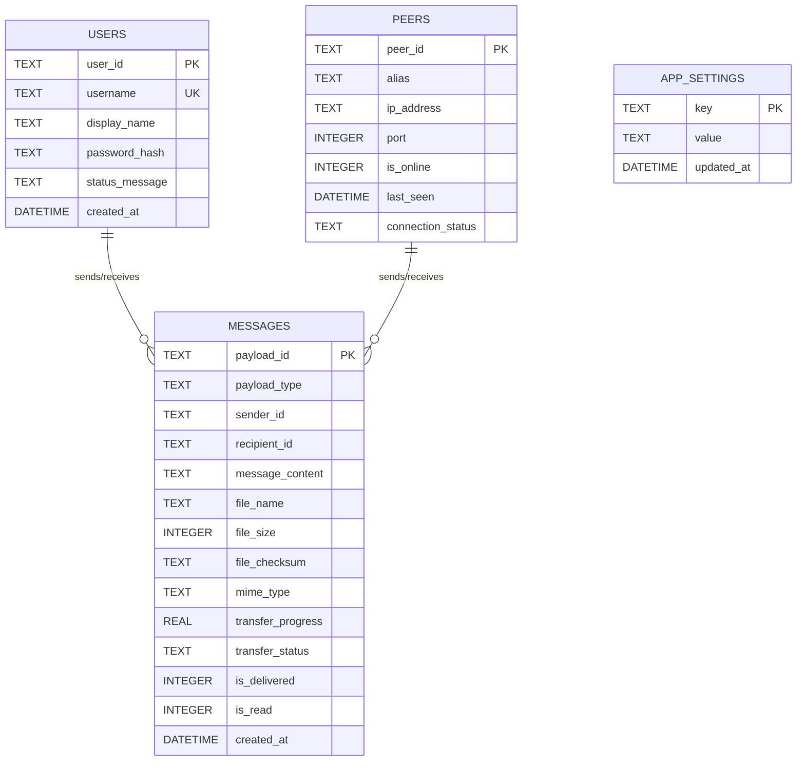

# 📡 Project-CX — Decentralized Peer-to-Peer Chat Application

> **A full-stack, decentralized P2P desktop chat application built entirely in Java**, demonstrating advanced Object-Oriented Programming, real-time WebRTC P2P communication, multithreaded GUI design, and SQLite database integration.

---

## Table of Contents

1. [Introduction](#1-introduction)
2. [Problem Statement](#2-problem-statement)
3. [Objective](#3-objective)
4. [Background](#4-background)
5. [Software Requirements Specification (SRS)](#5-software-requirements-specification-srs)
6. [Existing System](#6-existing-system)
7. [Disadvantages of Existing System](#7-disadvantages-of-existing-system)
8. [Proposed System](#8-proposed-system)
9. [Module Description](#9-module-description)
10. [OOP Concepts Demonstrated](#10-oop-concepts-demonstrated)
    - [Classes & Objects](#101-classes--objects)
    - [Encapsulation](#102-encapsulation)
    - [Inheritance](#103-inheritance)
    - [Polymorphism](#104-polymorphism)
    - [Abstraction](#105-abstraction)
    - [Method Overloading](#106-method-overloading)
    - [Method Overriding](#107-method-overriding)
    - [Constructor Overloading](#108-constructor-overloading)
    - [Object Relationships — Composition, Aggregation, Association](#109-object-relationships)
11. [Responsive GUI & Multithreading](#11-responsive-gui--multithreading)
12. [Database Integration](#12-database-integration)
13. [Advantages of the Proposed System](#13-advantages-of-the-proposed-system)
14. [UML Diagrams](#14-uml-diagrams)
    - [Use Case Diagram](#141-use-case-diagram)
    - [Class Diagram](#142-class-diagram)
15. [Database Design](#15-database-design)
16. [Advantages and Applications](#16-advantages-and-applications)

---

## 1. Introduction

**Project-CX** is a modern, fully decentralized peer-to-peer (P2P) desktop chat application built using **Java 21**, **JavaFX**, **WebRTC**, and **SQLite**. The application enables users on the same local network (LAN), mobile hotspot, or across the internet to discover each other automatically, establish direct encrypted P2P connections, and exchange text messages and files — all without any centralized chat server.

The project is designed as a comprehensive demonstration of **Object-Oriented Programming (OOP)** principles, **multithreaded GUI development**, and **real-time networking** in a production-grade Java application.

### Technology Stack

| Layer | Technology |
|---|---|
| **Language** | Java 21 (OpenJDK) |
| **GUI Framework** | JavaFX 21.0.2 |
| **P2P Communication** | WebRTC (via `webrtc-java` native bindings) |
| **Database** | SQLite 3.45.2 (via JDBC) |
| **Signaling Protocol** | Custom TCP Socket Protocol |
| **Peer Discovery** | UDP Multicast + Broadcast + Unicast Sweep + SQLite Heartbeat |
| **Build System** | Apache Maven 3.x |
| **Logging** | SLF4J + Logback |
| **Testing** | JUnit 5 Jupiter |

---

## 2. Problem Statement

In today's digital communication landscape, most messaging platforms (WhatsApp, Telegram, Discord, Slack) are built on a **centralized client-server architecture**. Every message sent between two users passes through a central company-owned server:

- **Privacy Risk**: A central server has full access to all user messages, metadata, and social graphs.
- **Single Point of Failure**: If the server goes down, all communication stops.
- **Dependency on Internet**: Users on the same local network still require internet connectivity to route messages through remote servers.
- **Vendor Lock-In**: Users are dependent on a company's infrastructure, policies, and terms of service.

There is a clear need for a **decentralized, serverless, peer-to-peer messaging system** that allows users to communicate directly without intermediaries.

---

## 3. Objective

1. **Build a fully decentralized P2P chat application** where messages travel directly between peers without any central message relay server.
2. **Demonstrate comprehensive OOP principles** including encapsulation, inheritance, polymorphism, abstraction, method/constructor overloading, method overriding, and all object relationships (composition, aggregation, association).
3. **Implement automatic peer discovery** over LAN, Wi-Fi, and mobile hotspots using multi-path discovery (UDP Multicast, Broadcast, Unicast Sweep, SQLite Heartbeat).
4. **Deliver a responsive, modern JavaFX GUI** that never freezes by strictly separating UI, database, and network operations across dedicated thread pools.
5. **Persist all data locally** using SQLite for user profiles, peer contacts, and chat history.
6. **Enable both LAN and Internet connectivity** through an optional lightweight signaling relay server for WebRTC negotiation across NATs.

---

## 4. Background

### Peer-to-Peer (P2P) Communication
P2P networking is a distributed architecture where each participant (peer) acts as both a client and a server. Unlike client-server systems, P2P eliminates central intermediaries. Examples include BitTorrent, Bitcoin, and IPFS.

### WebRTC (Web Real-Time Communication)
WebRTC is an open standard for real-time peer-to-peer data, audio, and video exchange. Originally designed for web browsers, the `webrtc-java` library brings native WebRTC capabilities to Java desktop applications. WebRTC provides:
- **Direct P2P DataChannels** for low-latency message and file transfer.
- **ICE (Interactive Connectivity Establishment)** for NAT traversal.
- **DTLS Encryption** for secure data transmission.

### JavaFX
JavaFX is a modern Java GUI framework for building rich desktop applications with CSS styling, scene graph rendering, and hardware-accelerated graphics.

---

## 5. Software Requirements Specification (SRS)

### 5.1 Functional Requirements

| ID | Requirement |
|---|---|
| FR-01 | Users shall be able to register and login with username/password authentication. |
| FR-02 | The system shall automatically discover peers on the same LAN or mobile hotspot. |
| FR-03 | Users shall be able to send and receive text messages in real-time. |
| FR-04 | Users shall be able to send and receive file transfers with progress tracking. |
| FR-05 | The system shall support 1-on-1 direct messaging between two peers. |
| FR-06 | The system shall support group chat with multi-peer broadcast messaging. |
| FR-07 | Users shall be able to send/accept/reject connection requests to peers. |
| FR-08 | All messages and contacts shall be persisted in a local SQLite database. |
| FR-09 | Multiple application instances shall be able to run simultaneously on the same machine. |
| FR-10 | The GUI shall remain responsive at all times during network and database operations. |

### 5.2 Non-Functional Requirements

| ID | Requirement |
|---|---|
| NFR-01 | The application shall support Java 21 or later. |
| NFR-02 | The GUI shall respond to user input within 100ms (no freezing). |
| NFR-03 | SQLite database shall use WAL mode for concurrent read/write safety. |
| NFR-04 | All network and database tasks shall execute on dedicated background thread pools. |
| NFR-05 | The system shall be cross-platform (Linux, macOS, Windows). |

### 5.3 Hardware & Software Requirements

| Component | Specification |
|---|---|
| **OS** | Linux / macOS / Windows |
| **JDK** | Java 21 (OpenJDK or Oracle) |
| **RAM** | Minimum 512 MB |
| **Network** | LAN, Wi-Fi, or Mobile Hotspot |
| **Build** | Maven 3.x |

---

## 6. Existing System

Conventional chat applications like WhatsApp, Telegram, and Discord use a **centralized client-server model**:

```
[User A] ──→ [Central Server] ──→ [User B]
```

- All messages pass through a company-owned server.
- The server stores, processes, and relays every message.
- Users cannot communicate without internet access to the server.
- The server has potential access to unencrypted metadata and message content.

---

## 7. Disadvantages of Existing System

| # | Disadvantage |
|---|---|
| 1 | **Privacy Risk**: Central server has access to all messages, contacts, and user metadata. |
| 2 | **Single Point of Failure**: Server outages disable all communication (e.g., WhatsApp global outage). |
| 3 | **Internet Dependency**: Users on the same LAN or room still require internet to chat. |
| 4 | **Vendor Lock-In**: Users are bound to a single provider's ecosystem and policies. |
| 5 | **Latency Overhead**: Messages travel to a remote server and back, adding unnecessary delay for local peers. |
| 6 | **Scalability Cost**: The central server must scale to handle millions of connections. |

---

## 8. Proposed System

Project-CX implements a **fully decentralized peer-to-peer architecture**:

```
[User A] ←──── Direct P2P Connection ────→ [User B]
                  (WebRTC DataChannel)
```

- Messages travel **directly between peers** — no central relay.
- Peers discover each other **automatically** on the same network using UDP multicast, broadcast, unicast sweeps, and SQLite heartbeat.
- For connections across the internet (different NATs), an optional lightweight **signaling server** (deployable via Docker) facilitates only the initial WebRTC handshake — **zero chat data passes through the signaling server**.
- All data is stored **locally** in an embedded SQLite database.

---

## 9. Module Description

### 9.1 Package Architecture

```
org.yu.projectcx
├── App.java                        # JavaFX Application entry point
├── Main.java                       # Standard Java main() launcher
├── core/                           # Business logic & session management
│   ├── AppConfig.java              # Global application configuration
│   ├── ChatEventListener.java      # Observer interface for UI events
│   ├── ChatManager.java            # Central application coordinator
│   ├── ChatService.java            # Chat session coordination service
│   ├── ChatSession.java            # Active 1-on-1 P2P session
│   ├── GroupChatSession.java        # Multi-peer group chat session
│   ├── MessageManager.java         # Session message tracking & filtering
│   ├── PayloadDispatcher.java       # Polymorphic payload dispatch engine
│   ├── PeerManager.java            # Peer directory (Aggregation)
│   └── SessionState.java           # Session lifecycle states (Enum)
├── model/                          # Data models & domain entities
│   ├── ConnectionStatus.java       # Peer connection lifecycle (Enum)
│   ├── FileTransfer.java           # File transfer payload (extends NetworkPayload)
│   ├── NetworkPayload.java         # Abstract base payload class
│   ├── PayloadParser.java          # Polymorphic wire-format parser
│   ├── PayloadType.java            # Payload type enumeration
│   ├── Peer.java                   # Remote peer entity
│   ├── PeerNode.java               # Peer metadata record
│   ├── TextMessage.java            # Text message payload (extends NetworkPayload)
│   ├── TransferStatus.java         # File transfer lifecycle (Enum)
│   └── User.java                   # Local user profile entity
├── network/
│   ├── discovery/
│   │   └── LanDiscoveryService.java # Automatic LAN/Hotspot peer discovery
│   ├── signaling/
│   │   ├── HostedSignalingServer.java  # Internet signaling relay server
│   │   ├── SignalingClient.java        # TCP signaling client
│   │   ├── SignalingEventListener.java # Signaling event interface
│   │   ├── SignalingManager.java       # High-level signaling coordinator
│   │   ├── SignalingMessage.java       # Signaling protocol message
│   │   ├── SignalingServer.java        # Embedded TCP signaling server
│   │   └── SignalingType.java          # Signaling message types (Enum)
│   └── webrtc/
│       ├── WebRTCDataChannelListener.java # WebRTC data event interface
│       └── WebRTCManager.java             # WebRTC PeerConnection manager
├── db/                             # SQLite database layer
│   ├── DatabaseManager.java        # Connection management & schema
│   ├── MessageRepository.java      # Message CRUD DAO
│   ├── PeerRepository.java         # Peer CRUD DAO
│   └── UserRepository.java         # User CRUD DAO
├── ui/                             # JavaFX GUI layer
│   ├── SceneNavigator.java         # View navigation controller
│   └── views/
│       ├── LoginView.java          # Login/Register screen
│       └── MainChatView.java       # Main chat interface
└── util/                           # Cross-cutting utilities
    ├── AsyncExecutor.java          # Thread pool management
    └── PlatformUtil.java           # OS/runtime detection
```

### 9.2 Module Summary

| Module | Purpose | Key Classes |
|---|---|---|
| **Core** | Business logic, session lifecycle, peer management | `ChatManager`, `ChatSession`, `GroupChatSession`, `PeerManager`, `MessageManager`, `ChatService`, `PayloadDispatcher` |
| **Model** | Domain entities, data structures, serialization | `User`, `Peer`, `NetworkPayload` (abstract), `TextMessage`, `FileTransfer`, `PayloadParser` |
| **Network: Discovery** | Automatic peer detection on LAN/Hotspot | `LanDiscoveryService` |
| **Network: Signaling** | WebRTC SDP/ICE exchange protocol | `SignalingServer`, `SignalingClient`, `SignalingManager`, `HostedSignalingServer` |
| **Network: WebRTC** | Native P2P DataChannel communication | `WebRTCManager` |
| **Database** | SQLite persistence (JDBC) | `DatabaseManager`, `UserRepository`, `PeerRepository`, `MessageRepository` |
| **UI** | JavaFX GUI screens | `LoginView`, `MainChatView`, `SceneNavigator` |
| **Util** | Thread pools, platform helpers | `AsyncExecutor`, `PlatformUtil` |

---

## 10. OOP Concepts Demonstrated

### 10.1 Classes & Objects

Project-CX contains **37+ Java classes** across 6 packages. Every entity in the system is modeled as a class with well-defined responsibilities:

| Class | Role | Package |
|---|---|---|
| `User` | Represents a local user profile with identity, display name, and status. | `model` |
| `Peer` | Represents a remote network peer with IP, port, and connection status. | `model` |
| `TextMessage` | A concrete text chat message payload. | `model` |
| `FileTransfer` | A concrete file transfer payload with progress and checksum tracking. | `model` |
| `NetworkPayload` | Abstract base class for all data payloads transmitted over the network. | `model` |
| `ChatManager` | Central application coordinator managing authentication, sessions, peers, and events. | `core` |
| `ChatSession` | Manages an active 1-on-1 P2P connection between a User and a Peer. | `core` |
| `GroupChatSession` | Manages multi-peer group chat with full-mesh P2P broadcast. | `core` |
| `PeerManager` | In-memory directory of discovered and registered peers. | `core` |
| `MessageManager` | Tracks, filters, and retrieves messages within a session. | `core` |
| `ChatService` | Coordinates chat session creation and message dispatching. | `core` |
| `PayloadDispatcher` | Polymorphically validates, serializes, and dispatches payloads. | `core` |
| `DatabaseManager` | SQLite connection lifecycle, schema creation, and WAL mode enforcement. | `db` |
| `UserRepository` | DAO for User CRUD operations in SQLite. | `db` |
| `PeerRepository` | DAO for Peer CRUD operations in SQLite. | `db` |
| `MessageRepository` | DAO for polymorphic NetworkPayload persistence in SQLite. | `db` |
| `SignalingServer` | Embedded TCP server for local WebRTC handshake negotiation. | `network.signaling` |
| `SignalingClient` | TCP client for sending signaling messages to remote peers. | `network.signaling` |
| `SignalingManager` | High-level coordinator for both local and hosted signaling. | `network.signaling` |
| `HostedSignalingServer` | Standalone deployable signaling relay for internet connections. | `network.signaling` |
| `WebRTCManager` | Native WebRTC PeerConnection, DataChannel, and SDP/ICE lifecycle manager. | `network.webrtc` |
| `LanDiscoveryService` | Multi-path automatic peer discovery (Multicast, Broadcast, Unicast, DB Heartbeat). | `network.discovery` |
| `AsyncExecutor` | Centralized thread pool management for DB, Network, and UI threads. | `util` |
| `LoginView` | JavaFX Login/Register screen with animations. | `ui.views` |
| `MainChatView` | JavaFX main chat interface with peer list, message area, and connection controls. | `ui.views` |
| `SceneNavigator` | Manages JavaFX scene transitions and window configuration. | `ui` |

**Objects** are created throughout the application. For example, when a user registers:
```java
User newUser = new User(username);  // Object creation
newUser.setDisplayName("Alice");
userRepository.saveUser(newUser, password);
```

---

### 10.2 Encapsulation

All model and domain classes use **private fields** with controlled **getter/setter** methods that include validation:

**Example — `User.java`:**
```java
public class User {
    // Private fields — not directly accessible from outside
    private String userId;
    private String username;
    private String displayName;
    private String statusMessage;
    private LocalDateTime createdAt;

    // Controlled setter with validation (Encapsulation)
    public void setUsername(String username) {
        if (username == null || username.trim().isEmpty()) {
            throw new IllegalArgumentException("Username cannot be null or blank.");
        }
        this.username = username.trim();
    }

    public String getUsername() {
        return username;
    }
}
```

**Example — `Peer.java`:**
```java
public void setPort(int port) {
    if (port < 1 || port > 65535) {
        throw new IllegalArgumentException("Port number must be between 1 and 65535.");
    }
    this.port = port;
}
```

**Where it appears:** `User`, `Peer`, `TextMessage`, `FileTransfer`, `NetworkPayload`, `SignalingMessage`, `ChatSession`, `MessageManager`.

---

### 10.3 Inheritance

The inheritance hierarchy is demonstrated through the **NetworkPayload** class hierarchy:

```
NetworkPayload (abstract)
    ├── TextMessage (concrete)
    └── FileTransfer (concrete)
```

**`TextMessage` extends `NetworkPayload`:**
```java
public class TextMessage extends NetworkPayload {
    private String messageContent;
    private boolean delivered;
    private boolean read;

    public TextMessage(String senderId, String recipientId, String messageContent) {
        super(PayloadType.TEXT, senderId, recipientId);  // Call to parent constructor
        setMessageContent(messageContent);
    }
}
```

**`FileTransfer` extends `NetworkPayload`:**
```java
public class FileTransfer extends NetworkPayload {
    private String fileName;
    private long fileSize;
    private String fileChecksum;

    public FileTransfer(String senderId, String recipientId, String fileName, long fileSize) {
        super(PayloadType.FILE_TRANSFER, senderId, recipientId);  // Call to parent constructor
        setFileName(fileName);
        setFileSize(fileSize);
    }
}
```

Both subclasses **inherit** common fields (`payloadId`, `type`, `senderId`, `recipientId`, `timestamp`) and methods (`getHeaderInfo()`, `equals()`, `hashCode()`, `toString()`) from the parent `NetworkPayload` class.

---

### 10.4 Polymorphism

Polymorphism allows heterogeneous payload handling through common `NetworkPayload` references:

**In `PayloadDispatcher.java` — Dynamic Dispatch:**
```java
public String dispatch(NetworkPayload payload) {
    payload.validate();           // Calls TextMessage.validate() or FileTransfer.validate()
    String wireData = payload.serialize();  // Calls TextMessage.serialize() or FileTransfer.serialize()
    logger.info("Dispatching: {}", payload.getSummary());  // Calls correct getSummary() at runtime
    return wireData;
}
```

**In `MessageRepository.java` — Polymorphic Database Hydration:**
```java
// Same method persists both TextMessage and FileTransfer
public void saveMessage(NetworkPayload payload) {
    if (payload instanceof TextMessage tm) { ... }
    else if (payload instanceof FileTransfer ft) { ... }
}
```

**In `ChatSession.sendMessage(NetworkPayload payload)` — Polymorphic Dispatch:**
```java
public synchronized NetworkPayload sendMessage(NetworkPayload payload) {
    payload.validate();
    messageManager.addMessage(payload);
    if (webrtcManager.isDataChannelOpen()) {
        webrtcManager.sendPayload(payload);  // Sends any NetworkPayload subtype
    }
    return payload;
}
```

---

### 10.5 Abstraction

**`NetworkPayload`** is an `abstract class` that cannot be directly instantiated. It defines an **abstract contract** that all payload types must implement:

```java
public abstract class NetworkPayload {
    // Abstract methods — must be implemented by subclasses
    public abstract String serialize();
    public abstract String getSummary();
    public abstract long getEstimatedSize();
    public abstract void validate() throws IllegalArgumentException;

    // Concrete shared method
    public String getHeaderInfo() {
        return String.format("[%s] From: %s -> To: %s @ %s", type, senderId, recipientId, timestamp);
    }
}
```

**Interfaces** also provide abstraction:

| Interface | Purpose |
|---|---|
| `ChatEventListener` | Observer for chat/peer/message events |
| `SignalingEventListener` | Observer for WebRTC signaling events |
| `WebRTCDataChannelListener` | Observer for P2P DataChannel lifecycle events |
| `PeerDiscoveryListener` | Observer for peer discovery events |
| `SessionPayloadListener` | Observer for session-level payload events |
| `PayloadListener` | Observer for dispatched payload events |

---

### 10.6 Method Overloading

Method overloading (same method name, different parameter lists) is used extensively:

**`ChatSession` — `sendMessage()` overloads:**
```java
// Overload 1: Simple text
public TextMessage sendMessage(String text);

// Overload 2: Text with delivery receipt control
public TextMessage sendMessage(String text, boolean requireDeliveryReceipt);

// Overload 3: Any polymorphic NetworkPayload
public NetworkPayload sendMessage(NetworkPayload payload);
```

**`ChatSession` — `sendFile()` overloads:**
```java
// Overload 1: Pre-built FileTransfer object
public FileTransfer sendFile(FileTransfer fileTransfer);

// Overload 2: Filename and size
public FileTransfer sendFile(String fileName, long fileSize);

// Overload 3: Full metadata with checksum and MIME type
public FileTransfer sendFile(String fileName, long fileSize, String checksum, String mimeType);
```

**`PeerManager` — `addPeer()` overloads:**
```java
public void addPeer(Peer peer);
public Peer addPeer(String peerId, String alias);
public Peer addPeer(String peerId, String alias, String ipAddress, int port);
```

**`PeerManager` — `getPeer()` overloads:**
```java
public Optional<Peer> getPeer(String peerId);
public Optional<Peer> getPeer(String ipAddress, int port);
```

**`MessageManager` — `addMessage()` and `getMessages()` overloads:**
```java
public void addMessage(NetworkPayload payload);
public TextMessage addMessage(String senderId, String recipientId, String textContent);

public List<NetworkPayload> getMessages(int limit);
public List<NetworkPayload> getMessages(PayloadType type);
public List<NetworkPayload> getMessages(PayloadType type, int limit);
```

**`ChatService` — `sendMessage()` overloads:**
```java
public TextMessage sendMessage(String text);
public TextMessage sendMessage(String text, String peerId);
public TextMessage sendMessage(String text, Peer peer);
public NetworkPayload sendMessage(NetworkPayload payload);
public NetworkPayload sendMessage(NetworkPayload payload, String peerId);
```

---

### 10.7 Method Overriding

Subclasses override abstract and concrete methods from their parent class:

**`TextMessage` overrides from `NetworkPayload`:**
```java
@Override
public String serialize() {
    return String.format("TYPE:TEXT|ID:%s|FROM:%s|TO:%s|TIME:%s|DELIV:%b|READ:%b|BODY:%s",
            getPayloadId(), getSenderId(), getRecipientId(), getTimestamp(), delivered, read, messageContent);
}

@Override
public String getSummary() {
    String preview = (messageContent.length() > 30) ? messageContent.substring(0, 27) + "..." : messageContent;
    return "[Text Message] " + preview;
}

@Override
public long getEstimatedSize() {
    return messageContent.getBytes(StandardCharsets.UTF_8).length + 64;
}

@Override
public void validate() throws IllegalArgumentException {
    if (messageContent == null) throw new IllegalArgumentException("Content cannot be null.");
    if (messageContent.length() > 10000) throw new IllegalArgumentException("Exceeds max length.");
}
```

**`FileTransfer` overrides from `NetworkPayload`:**
```java
@Override
public String serialize() {
    return String.format("TYPE:FILE|ID:%s|FROM:%s|TO:%s|TIME:%s|NAME:%s|SIZE:%d|HASH:%s|MIME:%s|PROG:%.2f|STAT:%s",
            getPayloadId(), getSenderId(), getRecipientId(), getTimestamp(),
            fileName, fileSize, fileChecksum, mimeType, transferProgress, status);
}

@Override
public String getSummary() {
    return String.format("[File Transfer] %s (%s, %.1f%%, %s)",
            fileName, getFormattedFileSize(), transferProgress, status);
}
```

Both `User`, `Peer`, `TextMessage`, `FileTransfer`, and `NetworkPayload` also override `Object.toString()`, `Object.equals()`, and `Object.hashCode()`.

---

### 10.8 Constructor Overloading

Multiple constructors with different parameter signatures provide flexible initialization:

**`User` — 4 constructor overloads:**
```java
public User()                                                               // Default
public User(String username)                                                 // By username
public User(String userId, String username, String displayName)              // By ID + name
public User(String userId, String username, String displayName,              // Full (DB hydration)
            String statusMessage, LocalDateTime createdAt)
```

**`Peer` — 5 constructor overloads:**
```java
public Peer()                                                                // Default
public Peer(String peerId, String alias)                                     // ID + alias
public Peer(String peerId, String alias, String ipAddress, int port)         // With endpoint
public Peer(String peerId, String alias, String ipAddress, int port,         // With online status
            boolean online, LocalDateTime lastSeen)
public Peer(String peerId, String alias, String ipAddress, int port,         // Full constructor
            boolean online, LocalDateTime lastSeen, ConnectionStatus status)
```

**`NetworkPayload` — 3 protected constructor overloads:**
```java
protected NetworkPayload(PayloadType type)
protected NetworkPayload(PayloadType type, String senderId, String recipientId)
protected NetworkPayload(String payloadId, PayloadType type, String senderId, String recipientId, LocalDateTime timestamp)
```

**`TextMessage` — 4 constructor overloads:**
```java
public TextMessage()
public TextMessage(String senderId, String recipientId, String messageContent)
public TextMessage(String senderId, String recipientId, String messageContent, boolean delivered, boolean read)
public TextMessage(String payloadId, String senderId, String recipientId, String messageContent,
                   LocalDateTime timestamp, boolean delivered, boolean read)
```

**`FileTransfer` — 4 constructor overloads:**
```java
public FileTransfer()
public FileTransfer(String senderId, String recipientId, String fileName, long fileSize)
public FileTransfer(String senderId, String recipientId, String fileName, long fileSize, String checksum, String mimeType)
public FileTransfer(String payloadId, String senderId, String recipientId, String fileName, long fileSize,
                    String checksum, String mimeType, double progress, TransferStatus status, LocalDateTime timestamp)
```

**`ChatService` — 2 constructor overloads:**
```java
public ChatService(User currentUser)
public ChatService(User currentUser, PeerManager peerManager)
```

**`DatabaseManager` — 2 constructor overloads:**
```java
public DatabaseManager()                    // Uses default "chat.db"
public DatabaseManager(String dbFilePath)   // Custom database path
```

---

### 10.9 Object Relationships

#### Composition (Strong "owns" — part dies when whole dies)

In composition, the contained object **cannot exist independently** of the container. When the container is destroyed, its composed parts are destroyed with it.

| Container | Composed Part | Explanation |
|---|---|---|
| `ChatSession` | `MessageManager` | Each session **creates and owns** its own `MessageManager`. When the session closes, the `MessageManager` is cleared and destroyed. |
| `ChatSession` | `WebRTCManager` | Each session **creates and owns** its own `WebRTCManager`. When the session closes, the `WebRTCManager.close()` is called, disposing the native WebRTC peer connection. |
| `SignalingManager` | `SignalingServer` + `SignalingClient` | The `SignalingManager` **creates** both server and client internally. They cannot exist without the manager. |

```java
// ChatSession.java — Composition
public class ChatSession {
    private final MessageManager messageManager;  // Composed: created inside constructor
    private WebRTCManager webrtcManager;           // Composed: created inside constructor

    public ChatSession(User localUser, Peer remotePeer, SignalingManager signalingManager) {
        this.messageManager = new MessageManager();  // Created here, owned by this session
        initWebRtcManager();                         // Created here, owned by this session
    }

    public synchronized void closeSession() {
        this.messageManager.clear();     // Composed part destroyed
        this.webrtcManager.close();      // Composed part destroyed
    }
}
```

#### Aggregation (Weak "has-a" — parts exist independently)

In aggregation, the contained objects **can exist independently** of the container. The container holds references but does not control their lifecycle.

| Container | Aggregated Part | Explanation |
|---|---|---|
| `PeerManager` | `Peer` objects | `PeerManager` aggregates a collection of `Peer` objects. Peers are independently created and can exist outside the manager. |
| `GroupChatSession` | `Peer` objects | Group chat aggregates member peers but does not own them. |
| `ChatManager` | `ChatSession` objects | Manages active sessions but each session has its own lifecycle. |

```java
// PeerManager.java — Aggregation
public class PeerManager {
    private final Map<String, Peer> peerDirectory;  // Aggregates independent Peer objects

    public synchronized void addPeer(Peer peer) {
        peerDirectory.put(peer.getPeerId(), peer);  // Peer exists independently
    }

    public synchronized Optional<Peer> removePeer(String peerId) {
        return Optional.ofNullable(peerDirectory.remove(peerId));  // Peer still exists after removal
    }
}
```

#### Association (Uses / Interacts with)

In association, objects are related but do not own each other. They interact through method calls.

| Class A | Class B | Association Type |
|---|---|---|
| `ChatSession` | `User` (localUser) | A session **associates** a local user. The user exists independently. |
| `ChatSession` | `Peer` (remotePeer) | A session **associates** a remote peer. The peer exists independently. |
| `UserRepository` | `DatabaseManager` | Repository **uses** DatabaseManager for connections. |
| `PeerRepository` | `DatabaseManager` | Repository **uses** DatabaseManager for connections. |
| `MessageRepository` | `DatabaseManager` | Repository **uses** DatabaseManager for connections. |
| `WebRTCManager` | `SignalingManager` | WebRTC manager **uses** signaling manager for SDP/ICE exchange. |
| `ChatManager` | `SignalingManager` | Central manager **uses** signaling for peer communication. |

```java
// ChatSession.java — Association
public class ChatSession {
    private final User localUser;     // Association: User exists independently
    private final Peer remotePeer;    // Association: Peer exists independently

    public ChatSession(User localUser, Peer remotePeer) {
        this.localUser = localUser;    // Associated, not composed
        this.remotePeer = remotePeer;  // Associated, not composed
    }
}
```

---

## 11. Responsive GUI & Multithreading

### Thread Architecture

Project-CX uses a strict **thread separation model** via `AsyncExecutor` to ensure the JavaFX GUI never freezes:

```
┌─────────────────────────────────────────────────────────────┐
│                    Thread Pool Architecture                  │
├──────────────────┬──────────────────┬───────────────────────┤
│ JavaFX App Thread│  DB Worker Pool  │  Network Worker Pool  │
│ (UI Rendering)   │  (3 threads)     │  (4 threads)          │
├──────────────────┼──────────────────┼───────────────────────┤
│ • Button clicks  │ • User login     │ • WebRTC negotiation  │
│ • Text input     │ • Save messages  │ • TCP signaling       │
│ • Scene updates  │ • Load contacts  │ • UDP discovery       │
│ • List rendering │ • Query history  │ • File transfers      │
│ • Animations     │ • Peer sync      │ • LAN sweep           │
└──────────────────┴──────────────────┴───────────────────────┘
         ▲                 │                    │
         │    Platform.runLater()               │
         └─────────────────┴────────────────────┘
              Results dispatched back to UI
```

### AsyncExecutor Implementation

```java
public class AsyncExecutor {
    // Dedicated Thread Pool for Database operations (3 daemon threads)
    private static final ExecutorService dbExecutor =
        Executors.newFixedThreadPool(3, new NamedThreadFactory("DB-Worker"));

    // Dedicated Thread Pool for Network operations (4 daemon threads)
    private static final ExecutorService networkExecutor =
        Executors.newFixedThreadPool(4, new NamedThreadFactory("Network-Worker"));

    // Scheduled pool for heartbeats and periodic tasks
    private static final ScheduledExecutorService scheduledExecutor =
        Executors.newScheduledThreadPool(2, new NamedThreadFactory("Scheduled-Worker"));

    // Database task on background thread
    public static <T> CompletableFuture<T> supplyAsyncDb(Supplier<T> supplier) {
        return CompletableFuture.supplyAsync(supplier, dbExecutor);
    }

    // Network task on background thread
    public static CompletableFuture<Void> runAsyncNetwork(Runnable task) {
        return CompletableFuture.runAsync(task, networkExecutor);
    }

    // Safe dispatch back to JavaFX UI thread
    public static void runOnFxThread(Runnable task) {
        if (Platform.isFxApplicationThread()) task.run();
        else Platform.runLater(task);
    }
}
```

### Usage Example — Login Flow

```java
// ChatManager.java — Login runs on DB thread, result dispatched to UI thread
public CompletableFuture<Optional<User>> loginAsync(String username, String password) {
    return AsyncExecutor.supplyAsyncDb(() -> {
        // Runs on DB-Worker thread (NOT blocking the UI)
        Optional<User> userOpt = userRepository.login(username, password);
        userOpt.ifPresent(this::setCurrentUser);
        return userOpt;
    });
}

// LoginView.java — UI thread handles result
chatManager.loginAsync(username, password).thenAccept(userOpt -> {
    AsyncExecutor.runOnFxThread(() -> {
        // Safely update JavaFX UI on the Application Thread
        if (userOpt.isPresent()) navigator.showMainChatView(userOpt.get());
        else showError("Invalid credentials.");
    });
});
```

---

## 12. Database Integration

### Database Engine: SQLite 3.45.2

Project-CX uses an embedded **SQLite** database (file: `chat.db`) with:
- **WAL (Write-Ahead Logging)** mode for concurrent read/write safety.
- **Foreign Key constraints** enforced on every connection.
- **Parameterized PreparedStatements** for SQL injection prevention.
- **Try-with-resources** for automatic connection cleanup.

### Schema Tables

| Table | Purpose | Key Columns |
|---|---|---|
| `users` | Registered user profiles | `user_id`, `username`, `display_name`, `password_hash`, `status_message`, `created_at` |
| `peers` | Known remote peer contacts | `peer_id`, `alias`, `ip_address`, `port`, `is_online`, `last_seen`, `connection_status` |
| `messages` | Chat messages and file transfers | `payload_id`, `payload_type`, `sender_id`, `recipient_id`, `message_content`, `file_name`, `file_size`, `is_delivered`, `is_read`, `created_at` |
| `app_settings` | Application key-value configuration | `key`, `value`, `updated_at` |

### DAO Repository Pattern

Each table has a dedicated **Data Access Object (DAO)** repository:

| Repository | Entity | Operations |
|---|---|---|
| `UserRepository` | `User` | `saveUser()`, `login()`, `getAllUsers()`, `deleteUserWithPassword()`, `updateProfile()` |
| `PeerRepository` | `Peer` | `savePeer()`, `getAllPeers()`, `updateConnectionStatus()`, `saveHeartbeat()`, `getActiveLivePeers()` |
| `MessageRepository` | `NetworkPayload` | `saveMessage()`, `getConversationHistory()`, `getDistinctConversationPeers()`, `deleteConversation()` |

### Connection Management

```java
public class DatabaseManager implements AutoCloseable {
    public Connection getConnection() throws SQLException {
        Connection conn = DriverManager.getConnection(dbUrl);
        try (Statement stmt = conn.createStatement()) {
            stmt.execute("PRAGMA foreign_keys = ON;");
            stmt.execute("PRAGMA journal_mode = WAL;");
        }
        return conn;
    }
}
```

---

## 13. Advantages of the Proposed System

| # | Advantage |
|---|---|
| 1 | **Zero Central Server Required**: Messages travel directly peer-to-peer. No company owns your data. |
| 2 | **Works Offline on LAN**: Users on the same network can chat without any internet connection. |
| 3 | **Works on Mobile Hotspot**: Dedicated unicast sweep handles Android/iOS hotspot environments where multicast is blocked. |
| 4 | **Multi-Instance Support**: Multiple app instances can run simultaneously on the same machine (auto-port binding). |
| 5 | **End-to-End Encryption Ready**: WebRTC DataChannels use DTLS encryption by default. |
| 6 | **Responsive GUI**: Strict thread separation ensures the UI never freezes during heavy operations. |
| 7 | **Persistent Storage**: SQLite preserves user profiles, contacts, and chat history across sessions. |
| 8 | **Cross-Platform**: Runs on Linux, macOS, and Windows via Java 21. |
| 9 | **Optional Internet Relay**: An optional lightweight signaling server enables connections across different networks/NATs. |
| 10 | **Full OOP Design**: Clean, maintainable architecture using all major OOP principles. |

---

## 14. UML Diagrams

### 14.1 Use Case Diagram



### 14.2 Class Diagram



---

## 15. Database Design

### Entity-Relationship Diagram



### Table DDL

```sql
-- 1. Users Table
CREATE TABLE IF NOT EXISTS users (
    user_id TEXT PRIMARY KEY,
    username TEXT UNIQUE NOT NULL,
    display_name TEXT NOT NULL,
    password_hash TEXT NOT NULL,
    status_message TEXT DEFAULT 'Available',
    created_at DATETIME DEFAULT CURRENT_TIMESTAMP
);

-- 2. Peers Table
CREATE TABLE IF NOT EXISTS peers (
    peer_id TEXT PRIMARY KEY,
    alias TEXT NOT NULL,
    ip_address TEXT DEFAULT '127.0.0.1',
    port INTEGER DEFAULT 8080,
    is_online INTEGER DEFAULT 0,
    last_seen DATETIME DEFAULT CURRENT_TIMESTAMP,
    connection_status TEXT DEFAULT 'DISCOVERED'
);

-- 3. Messages Table (Polymorphic: TextMessage + FileTransfer)
CREATE TABLE IF NOT EXISTS messages (
    payload_id TEXT PRIMARY KEY,
    payload_type TEXT NOT NULL,
    sender_id TEXT NOT NULL,
    recipient_id TEXT NOT NULL,
    message_content TEXT,
    file_name TEXT,
    file_size INTEGER DEFAULT 0,
    file_checksum TEXT,
    mime_type TEXT,
    transfer_progress REAL DEFAULT 0.0,
    transfer_status TEXT,
    is_delivered INTEGER DEFAULT 0,
    is_read INTEGER DEFAULT 0,
    created_at DATETIME DEFAULT CURRENT_TIMESTAMP
);

-- 4. App Settings Table
CREATE TABLE IF NOT EXISTS app_settings (
    key TEXT PRIMARY KEY,
    value TEXT NOT NULL,
    updated_at DATETIME DEFAULT CURRENT_TIMESTAMP
);
```

---

## 16. Advantages and Applications

### Advantages

| Category | Advantage |
|---|---|
| **Privacy** | No central server stores or reads messages. All data stays local. |
| **Resilience** | No single point of failure. Communication works even without internet (on LAN). |
| **Performance** | Direct P2P eliminates server round-trip latency. Messages are nearly instantaneous on LAN. |
| **Security** | WebRTC DataChannels use DTLS encryption. Password hashing via SHA-256. |
| **Scalability** | Each peer is its own server. No central infrastructure to scale. |
| **Portability** | Cross-platform Java application runs on any OS with JDK 21. |
| **Multi-Instance** | Multiple instances on the same machine auto-bind to dynamic ports. |
| **Extensibility** | Clean OOP architecture makes it easy to add video/audio calls, screen sharing, or blockchain integration. |

### Applications

| Application | Description |
|---|---|
| **Secure Workplace Chat** | Internal team communication on a private LAN without relying on external services. |
| **Classroom/Lab Network** | Students and teachers communicate on a local school/university network. |
| **Disaster Relief** | Communication when internet infrastructure is down — works over any LAN or hotspot. |
| **Military/Government** | Secure, decentralized communication without data passing through third-party servers. |
| **IoT/Embedded Systems** | Lightweight P2P messaging between devices on the same network. |
| **LAN Parties/Events** | Instant messaging at conferences, gaming events, or gatherings without internet. |
| **Privacy-Focused Messaging** | For users who want full control over their communication data. |

---

> **Project-CX** — Built with ❤️ as a comprehensive demonstration of Java OOP, real-time P2P networking, and modern desktop application development.
